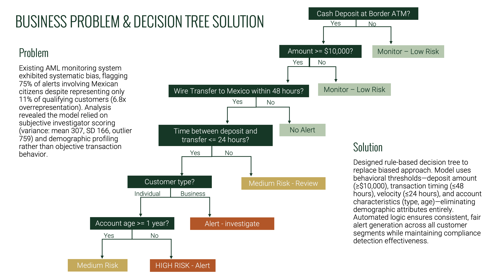

# Risk & Responsible Analytics Foundations

**Applied analytics across compliance, forecasting, and ethical decision-making scenarios in a simulated banking environment.**

---

## Project Background

This project is a collection of applied analyst scenarios rather than a single end-to-end case study. As an analyst supporting compliance and operations at a simulated bank, different analytical methods were applied depending on the business risk: rule-based decision trees for AML monitoring, time series decomposition for demand forecasting, and governance frameworks for data ethics and privacy protection.

The scenarios used separate datasets (AML transactions, retail sales from 1992-2017, oil prices from 1987-2019, and PII audit data) with no shared schema. The goal was to demonstrate versatile, production-ready analytics skills across common banking use cases, prioritizing explainability and risk control over complex modeling.

## Data Structure

Each scenario operated on its own dataset. The AML component used transaction records with deposit amounts, transfer timing, account characteristics, and demographic attributes. The time series analysis worked with historical retail sales and oil price data spanning 25+ years. The data ethics module used a simulated customer database containing PII fields to identify security vulnerabilities. All analysis was conducted in Excel using statistical modeling, decision tree logic, and time series techniques.

## Executive Summary

Across three applied scenarios, the analysis demonstrated how an analyst can reduce regulatory risk, enable proactive planning, and strengthen data governance using interpretable, explainable methods. The common thread is choosing practical techniques suited to regulated environments where transparency matters more than model complexity.

**Top Findings:**

1. **The existing AML monitoring system exhibited 6.8x demographic bias.** The model flagged 75% of alerts involving Mexican citizens despite representing only 11% of qualifying customers. Analysis revealed the system relied on subjective investigator scoring (variance: mean 307, SD 166) and demographic profiling rather than objective transaction behavior.

2. **A behavior-based decision tree eliminated demographic bias while maintaining compliance.** By replacing demographic attributes with behavioral thresholds (deposit amount, transaction timing, velocity, and account characteristics), the redesigned model generates consistent, fair alerts across all customer segments.

3. **Time series decomposition identified actionable seasonal patterns.** Trend and seasonality analysis across retail sales and oil price data enabled proactive staffing and inventory decisions rather than reactive planning.

## Insights Deep Dive

### Bias in AML Monitoring Creates Regulatory and Ethical Risk

The original AML alert system used a combination of demographic profiling and subjective investigator scoring to flag suspicious transactions. This approach produced severe overrepresentation: one demographic group received 75% of alerts while making up only 11% of qualifying customers. The investigator scoring showed high variance (SD of 166 against a mean of 307, with an outlier at 759), meaning alert generation was inconsistent and dependent on who reviewed the case. In a regulated environment, this kind of bias exposes the institution to Fair Lending Act violations and discrimination lawsuits while also missing genuinely suspicious activity from other customer segments.

### Behavioral Thresholds Produce Fair, Consistent Alerts

The replacement decision tree uses only objective transaction characteristics: whether the deposit was made at a border ATM, whether the amount exceeds $10,000, wire transfer timing relative to Mexico (within 48 hours), velocity between deposit and transfer (within 24 hours), customer type (individual vs. business), and account age. Demographic attributes like nationality, ethnicity, and gender are excluded entirely. The automated logic ensures every transaction is evaluated against the same criteria, producing consistent risk classifications from "Monitor - Low Risk" through "HIGH RISK - Alert" without subjective human scoring introducing variance.

### Governance and Forecasting Round Out Core Analyst Capabilities

The time series component applied moving averages and seasonal decomposition to identify trends in retail sales and oil price volatility, translating pattern recognition into proactive planning recommendations. The data ethics module identified PII vulnerabilities in simulated customer databases (exposed fields, inadequate device policies, missing access controls) and developed privacy protection controls aligned with regulatory requirements. Together with the AML work, these scenarios demonstrate the breadth of analytical judgment required in compliance-heavy environments.

## Recommendations

**Replace demographic-based alert systems with behavioral rule logic.** Transaction characteristics like deposit amount, timing, velocity, and account age are more defensible, more consistent, and more effective at detecting suspicious activity than demographic profiling. Automated decision trees ensure 100% consistent application across all customer segments.

**Use interpretable models in regulated environments.** Decision trees, threshold-based rules, and clear classification logic are easier for auditors, regulators, and business stakeholders to understand and validate. In compliance contexts, explainability is not optional.

**Implement proactive planning using time series patterns.** Seasonal decomposition and trend analysis enable staffing and inventory decisions to be made ahead of demand shifts rather than reactively, reducing both understaffing costs and overstaffing waste.

**Audit data systems for PII exposure and access control gaps.** Regular governance reviews should identify exposed personal information, inadequate device policies, and missing security controls before they become regulatory incidents.

## Tools & Skills

| Tool | Use |
|------|-----|
| Excel | Statistical analysis, time series decomposition, decision tree design |
| Statistical Modeling | Variance analysis, R² regression, bias quantification |
| Time Series | Trend identification, seasonality decomposition, moving averages |
| Decision Trees | Rule-based classification for AML alert logic |

Analytical techniques: bias detection and mitigation, data ethics and compliance frameworks, PII vulnerability assessment, forecasting for operational planning.

## Deliverables

| Document | Description |
|----------|-------------|
| [AML Decision Tree](deliverables/) | Bias-free alert logic using behavioral thresholds |
| [Data Ethics Framework](deliverables/) | PII vulnerability assessment and privacy controls |
| [Time Series Forecasting](analysis/) | Retail sales and oil price trend analysis |
| [Predictive Analysis](analysis/) | Statistical modeling and regression exercises |

## Author

**Jess Duong** | Data Analyst  
[LinkedIn](https://www.linkedin.com/in/jess-duong/) | [Portfolio](https://jess-duong.github.io/) | duong.t.jess@gmail.com

---

*Applied analytics exercises completed as part of CareerFoundry's Data Analytics program. Business context and stakeholders were simulated; datasets are not from live production systems.*
